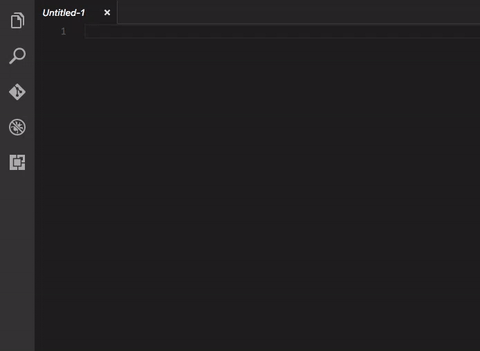

# elasticsearch-snippets

This extension provides code JSON code snippets for the more commonly used queries in the Elasticsearch Query DSL.

## Features

* Filtered query
* Nested query
* Bool query
* Term query
* Range query
* Exists query
* Ids query
* Match query (boolean)
* Common Terms query
* Function Score query

### 0.0.1

Initial release.

### For more information

* [Elasticsearch Query DSL](https://www.elastic.co/guide/en/elasticsearch/reference/current/query-dsl.html)

**Enjoy!**